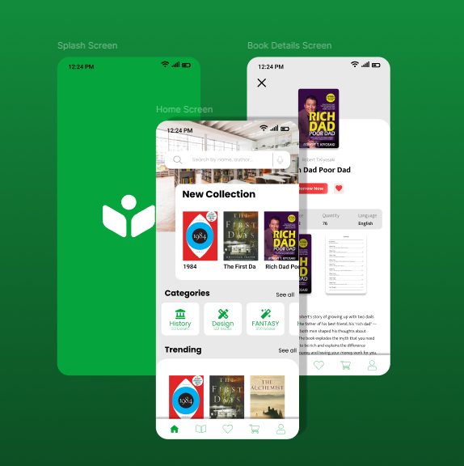

# 📚 Maktabati - Smart Library System


## 📖 Overview


**Maktabati** is a full-stack mobile application designed to streamline the process of browsing, managing, and borrowing books. Developed during a software engineering internship, this project bridges a modern, responsive mobile interface with a robust backend architecture.

The app allows users to explore book collections, view detailed metadata, manage a "borrowing cart," and maintain a personal profile, simulating a real-world digital library experience.

---

## ✨ Key Features

* **User Authentication:** Secure Sign Up and Login flow with validation.
* **Dynamic Home Screen:** showcasing "New Collections," "Trending" books, and categorized browsing (History, Design, Fantasy, etc.).
* **Advanced Search:** Real-time search functionality to find books by title or author.
* **Book Details:** Comprehensive view including author info, descriptions, availability status, and a "Borrow Now" feature.
* **Favorites & Cart:** Users can save books for later or add them to a cart for checkout/borrowing.
* **Profile Management:** User profile editing and settings configuration.

---

## 📸 Screenshots

| Splash & Home | Book Details | Borrowing Flow |
|:---:|:---:|:---:|
|  |  |  |

---

## 🛠️ Tech Stack

### Mobile Application (Frontend)
* **Framework:** Flutter (Dart)
* **State Management:** [e.g., Provider / GetX / Bloc]
* **UI/UX:** Custom Material Design implementation

### Backend API
* **Runtime:** Node.js
* **Framework:** Express.js (REST API)
* **Authentication:** [e.g., JWT (JSON Web Tokens)]

### Database
* **Database:** MySQL
* **ORM/Query Builder:** [e.g., Sequelize / TypeORM / Raw SQL]

---

## 🚀 Getting Started

Follow these instructions to set up the project locally.

### Prerequisites
* [Flutter SDK](https://flutter.dev/docs/get-started/install)
* [Node.js](https://nodejs.org/) (v14 or higher)
* MySQL Server installed and running

### 1. Backend Setup

```bash
# Navigate to the backend directory
cd backend

# Install dependencies
npm install

# Configure Database
# Create a .env file and add your DB credentials:
# DB_HOST=localhost
# DB_USER=root
# DB_PASS=password
# DB_NAME=library_db

# Run the server
npm start
